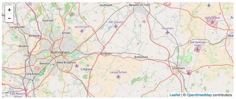

# Leaflet Smoth Zoom
> Fixes the default leaflet zoom on OSX


### Usage

```javascript
var map = L.map('map', {
  smothZoom: true,
  smothZoomDelay: 1000 //Default to 1000
});
```

### Without Smoth Zoom plugin

# 

### With Smoth Zoom plugin
    
# 