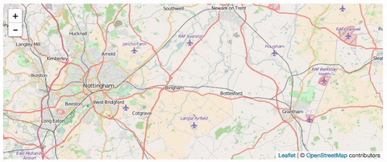

#Leaflet Smooth Zoom [](https://badge.fury.io/js/kakapo) [](https://badge.fury.io/bo/Leaflet.smoothzoom) [](https://tldrlegal.com/license/mit-license)

> Fixes the default leaflet zoom on OSX - [DEMO](http://zzarcon.github.io/Leaflet.smoothzoom/)

### Usage

```javascript
var map = L.map('map', {
  smoothZoom: true,
  smoothZoomDelay: 1000 //Default to 1000
});
```

### Without Smooth Zoom plugin

# 

### With Smooth Zoom plugin
    
# 

### Dependencies

None 😼